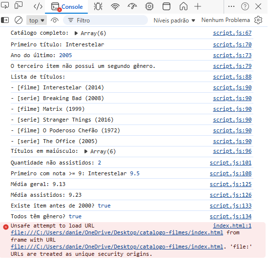

# Atividade Prática - Objetos e Arrays (JSON)

Nome: Daniell Cardoso  
Matrícula: 917809  

## Descrição
Este projeto implementa um catálogo simples de filmes e séries utilizando JavaScript, com uso de iterators como forEach, map, filter, find, reduce, some e every.

## Funcionalidades
- Listagem de títulos
- Cálculo de médias
- Filtro de não assistidos
- Ranking de melhores notas
- Exibição de resumo na tela

## Prints

## 🖥️ Prints do Console

---

## 🌐 Print da Página

